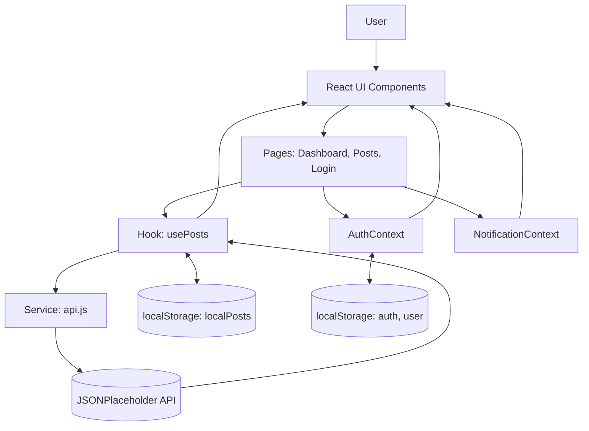

## User Dashboard

Lightweight, responsive dashboard for browsing and managing simple data entries. Built with React, Vite, and CSS Modules, featuring a reusable UI kit, mocked auth, notifications, and robust API integration with JSONPlaceholder.

### Overview
- Purpose: Provide a foundational dashboard with browsing, search, pagination, CRUD, notifications, and charts.
- Status: Developer-ready. No backend server required beyond public JSONPlaceholder.
- License: MIT

### Requirements
- Node.js 18+ and npm 9+
- Modern browser (Chrome/Edge/Firefox/Safari)

## Tech Stack

- Frontend: React + Vite
- State: React Hooks + Context API (`AuthContext`, `NotificationContext`)
- UI: CSS
- Charts: Nivo (Line, Bar, Pie, Geo)
- API: JSONPlaceholder (`https://jsonplaceholder.typicode.com`)
- Version Control: Git/GitHub

## Features

- Responsive dashboard layout with sidebar and topbar
- Reusable UI components: `Button`, `Input`, `Modal`, `Table`
- Posts management page:
  - Fetches posts from JSONPlaceholder
  - Search (client-side), pagination, and result counts
  - Create and edit posts via modal form
  - Delete posts
  - Local entries persisted to `localStorage` and merged with remote data
  - Loading skeletons and error notifications
- Notifications widget with success/error/warning/info toasts
- Mock authentication (email/password) with token and user stored in `localStorage`
- Dashboard with KPIs and Nivo charts, plus a recent posts widget

## Scripts

```bash
npm install        # install dependencies
npm run dev        # start dev server
npm run build      # production build
npm run preview    # preview built app
npm run lint       # run eslint
```

## Project Structure

```
src/
  pages/
    Dashboard.jsx        # KPI + charts + recent posts
    Posts.jsx            # searchable, paginated CRUD table
    Login.jsx            # mocked login flow
  components/
    UI/                  # Button, Input, Modal, Table (+ CSS modules)
    Charts/              # Nivo chart wrappers
    utilities/           # Notification UI + Time utility
  context/
    AuthContext.jsx      # mocked auth (token in localStorage)
    NotificationContext.jsx
  hooks/
    usePosts.js          # fetch/merge, search, paginate, CRUD helpers
  services/
    api.js               # JSONPlaceholder client
```

Notes:

- Local posts are stored in `localStorage` under key `localPosts` and merged with remote results by `id`.
- In `Posts.jsx`, local items are marked with `isLocal` to handle updates/deletes without remote round-trips.

## Live Demo

https://user-dashboard-ehab-nasr.vercel.app/

## Running the App Locally

1. Clone the repo and install dependencies

```bash
git clone <your-repo-url>.git
cd User Dashboard
npm install
```

2. Start development server

```bash
npm run dev
```

3. Open the app at the local URL printed in the terminal.

## Usage

- Login (mocked):
  - Email: `admin@dashboard.com`
  - Password: `password`
- Navigate to Posts to search, paginate, create, edit, and delete entries.
- Newly created posts are stored locally and merged with remote data.

## API Endpoints Used

Base URL: `https://jsonplaceholder.typicode.com`

- `GET /posts` — list posts
- `GET /posts/:id` — get a single post
- `POST /posts` — create post (echoed, not persisted remotely)
- `PUT /posts/:id` — update post (echoed)
- `DELETE /posts/:id` — delete post (echoed)

## Architecture & Decisions

- Data fetching and merge logic isolated in `hooks/usePosts.js`.
- `services/api.js` centralizes HTTP requests and JSON handling.
- UI primitives (`components/UI`) encourage reuse and consistency.
- Global concerns via Context:
  - `AuthContext` for mocked auth and session state in `localStorage`.
  - `NotificationContext` for transient toasts (success, error, warning, info).
- CSS Modules for encapsulated styles; lightweight utility classes for layout.

## Accessibility & UX

- Keyboard focusable buttons and form controls.
- Clear loading and empty states.
- Descriptive labels and `aria-label`s for icon-only actions.

## Architecture Diagram



## License

MIT
